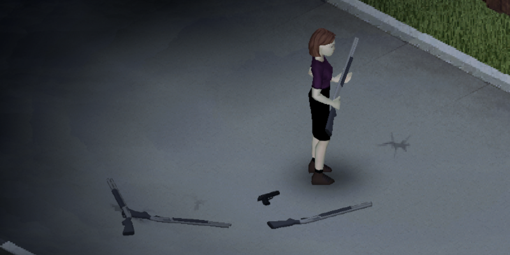
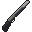

# lk_weapons

:warning: for Project Zomboid B41!

this is a project I'm working on that will hopefully fill out the roster of weapons for Project Zomboid a little bit. I intend to add a set of weapons, although currently this only includes a semi-automatic shotgun. This is intended to be vanilla-friendly, and I will be adding a few more weapons in the future. I'm also open to suggestions, so if you have any ideas for weapons you'd like to see in the game, feel free to let me know! I'm also open to suggestions for balancing, as I'm not the best at that.

Additionally, I'm hoping to add a feature allowing shotguns to load multiple types of shells, so you can load a slug and buckshot at the same time. This will require some custom Lua, which may break compatibility with some other mods.

## Features

| Gun Name                                                                                      | ID                              | Ammo Type         | Operation                         | Capacity    |
| --------------------------------------------------------------------------------------------- | ------------------------------- | ----------------- | --------------------------------- | ----------- |
|  Remington 11-87           | Base.RemingtonModel1187         | Shotgun Shells    | Semi-Automatic (semiautoshotgun)  | 7           |

## Planned Features

I'm trying to keep this list lore-friendly, meaning that they would have been available in Kentucky in 1993. Not all of this information will be available in-game for balance and simplicity, but I'm including it here for reference; for example, the Glock series has multiple capacities listed, but it will depend on which models I choose to implement. Some weapons, such as the Smith & Wesson Model 1076, were likely used by Kentucky state police, and so I'm including them in this list. Annoyingly, automatic regulations were introduced in 1994, so information about these firearms from before this time is hard to find.

| Weapon Name                           | Ammo Type                            | Type          | Operation                               | Capacity               | Year of Introduction  | Note                                   |
| ------------------------------------- | ------------------------------------ | ------------  | --------------------------------------- | ---------------------- | --------------------- | -------------------------------------- |
| Intratec Tec-9                        | 9x19mm                               | Pistol        | Semi-Automatic* (non-auto ATF redesign) | 10, 20, 32             | 1985                  |                                        |
| Colt Single Action Army               | .45 Auto, .44 Magnum, .38 Special    | Revolver      | Single-Action                           | 6                      | 1976 gen3 (1872 gen1) | Single action works, just needs assets |
| Glock 27/35/17/18                     | .40 S&W, 9x19mm                      | Pistol        | Semi-Automatic, Automatic*              | 9, 15, 17, 19, 24, 33  | 1990                  |                                        |
| Smith & Wesson Model 1076             | 10mm (.40)                           | Pistol        | Semi-Automatic                          | 9                      | 1990                  |                                        |
| MAC-10 / MAC-11                       | .45 ACP, 9x19mm                      | SMG           | Semi-Automatic, Automatic*              | 30, 32                 | 1970                  |                                        |
| H&K MP5 / MP5K / SP89                 | 9x19mm, .40 S&W, 10mm auto           | SMG           | Semi-Automatic, Automatic*              | 15, 30                 | 1966 / 1976 / 1989    |                                        |
| Browning Auto-5 / Remington Model 11  | 12g, 16g, 20g shells & slugs         | Shotgun       | Semi-Automatic                          | 2+1, 4+1               | 1898 (1902–1998)      |                                        |
| Benelli M3                            | 12g, 20g shell & slugs               | Shotgun       | Semi-Automatic, Pump Action**           | 7+1, 5+1 (civ)         | 1989                  |                                        |
| Franchi SPAS-12                       | 12g shell                            | Shotgun       | Semi-Automatic, Pump Action**           | 5+1 to 8+1             | 1979                  |                                        |
| Ithaca Model 37/87/Remington Model 17 | 12, 16, 20, or 28 gauge              | Shotgun       | Pump Action                             | 4, 5, or 7-round       | 1937                  | lighter than other shotguns            |
| Mossberg 500/590                      | 12 gauge, 20 gauge, and .410 bore    | Shotgun       | Pump Action                             | 6+1 to 8+1             | 590: 1961             |                                        |
| Knight's Armament Company Masterkey   | 12g                                  | Attachment    | Pump Action                             | 3+1                    | 1980s?                | wishlist feature, not a priority       |
| Beretta 682                           | 12g, 20g, 28g, .410 bore             | Shotgun       | Break Action                            | 2                      | 1984                  |                                        |
| Knight's Armament SR-25               | 7.62x51mm NATO / .308? (shh)         | Battle Rifle  | Semi-Automatic                          | 10, 20 round           | early 1990s??         | not sure if this fits due to timeframe |
| AKM, AK-74, AK-74M                    | 7.62x39mm (AKM), 5.45x39mm (74)      | Assault Rifle | Automatic, Semi-Automatic               | 10, 20, 30, 40, 75     | 1959, 1974, 1991      | NATO cartridge versions dont exist yet |
| FAMAS F1                              | 5.56x45mm NATO / .223? (shh)         | Assault Rifle | Automatic, Semi-Automatic, Burst        | 25                     | 1975                  |                                        |
| Remington M-24                        | 7.62x51mm (M24/A2) / .338 (M24A3)    | Sniper Rifle  | Bolt Action                             | 5 internal or box      | 1988                  | needs a high zoom & accuracy           |

\* I might make it possible to mod these to be full-auto, or they might spawn like it. Depends on the weapon and how I feel about it.
\*\* The Benelli M3 and Franchi SPAS-12 are hybrid shotguns, allowing for semi-automatic fire as well as pump action. Implementation will depend on ammo types (due to recoil differences between shells affecting automatic operation) and gameplay (semi-automatic beats pump action for this game imo).

## Known Issues

- The Remington 11-87 is currently the only weapon in the mod, but I'm working on adding more.
- The ejection port on the 11-87 is on the wrong side.
- Basegame currently has no ideal way to tune firerate, as it's a product of aiming skill and a few more factors. I'm hoping to simplify this. Currently the shotgun is a little too fast, but it's much better than being far too slow.
- The weapons do not currently spawn in the world, as far as I can tell. I will implement this soon.

## Installation

Currently this can be installed by cloning the project and copying it to C:\\Users\\\[user\]\\Zomboid\\mods. I'll add this to the Steam workshop at some point, but I'm working on other stuff at the minute.

## Hacking

Feel free to modify or redistribute this project, as it's licensed under [GPLv3](LICENSE). Any derivative work must be licensed under GPLv3. And I guess any non-software assets fall under .
